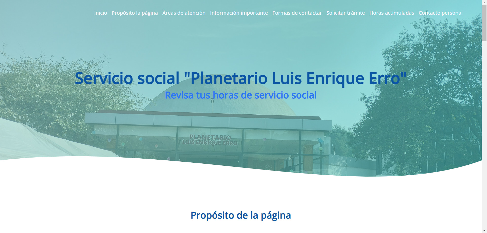
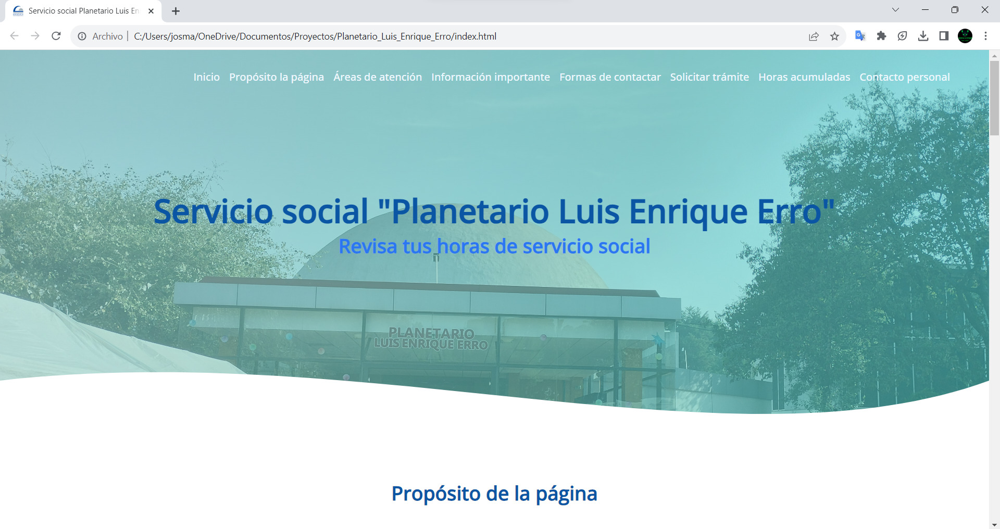
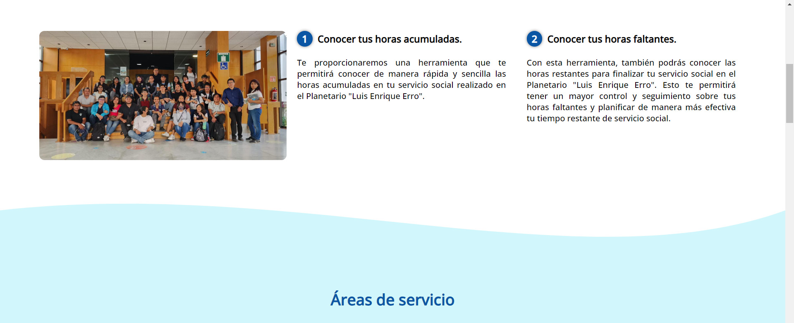
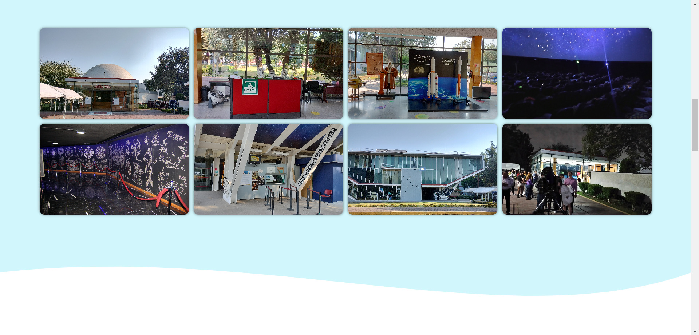
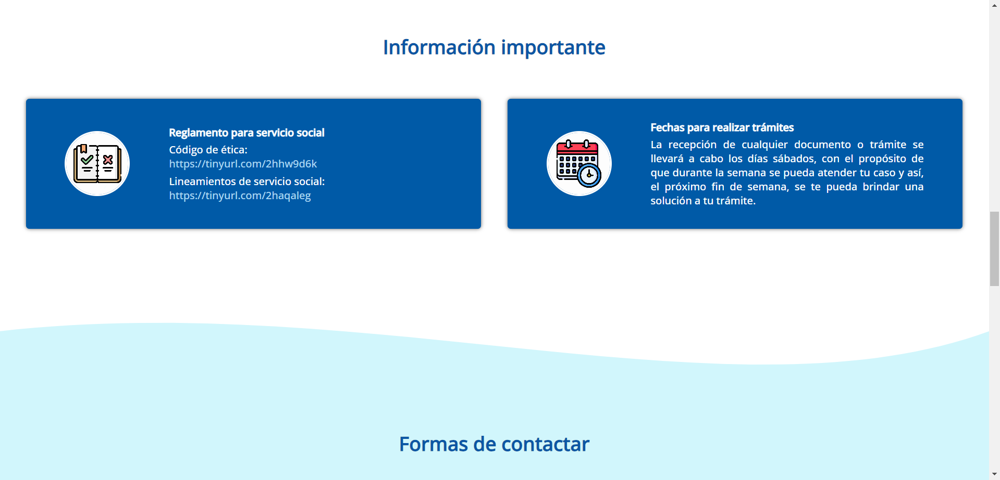
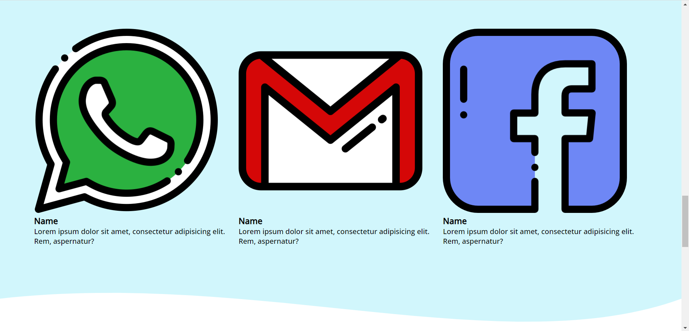
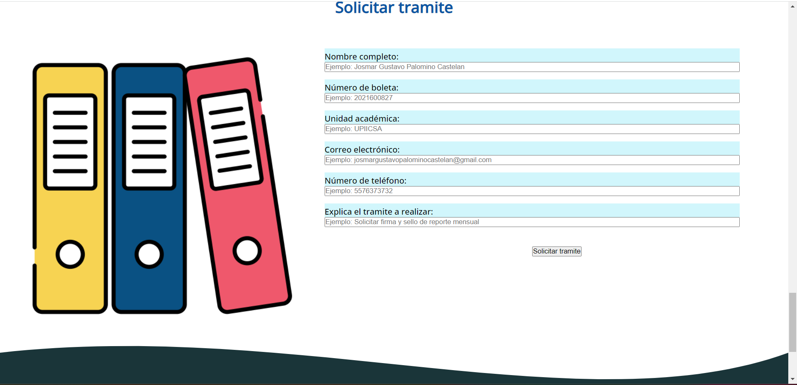
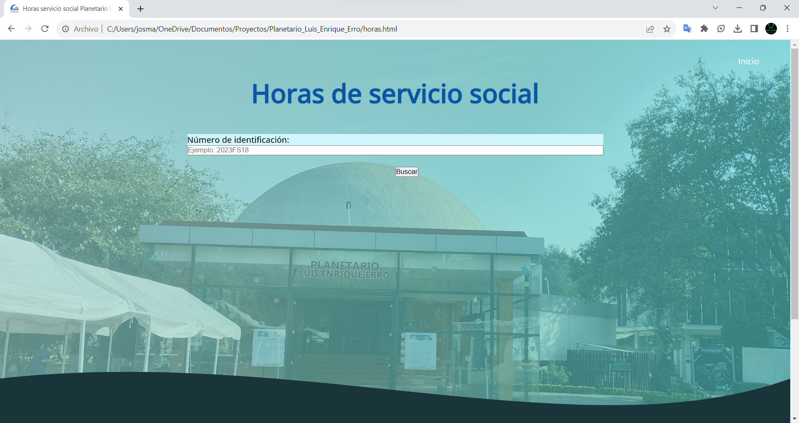

# Presentación

Este repositorio alberga el **diseño inicial y la primera versión del desarrollo de un sitio web** destinado al **Planetario Luis Enrique Erro del Instituto Politécnico Nacional (IPN).** El **propósito de este sitio web es proporcionar información acerca del servicio social** y, además, **visualizar las horas de servicio** de cada miembro del equipo de servicio social (es importante destacar que en esta primera versión, las horas aún no se encuentran disponibles).

<h1 align="center"> Página Web del Planetario Luis Enrique Erro para Servicio Social </h1>

 Pantalla principal de la interfaz 

# Tabla de contenidos:

---

- [Badges](#badges)
- [Capturas de pantalla](#capturas-de-pantalla)
- [Descripción del proyecto](#descripción-del-proyecto)
- [Herramientas utilizadas](#herramientas-utilizadas)
- [Guía de instalación](#guía-de-instalación)
- [Autor](#autores)
- [Información adicional](#información-adicional)

# Badges

---

- Estado del Proyecto: 
- Versión Actual: 
- Uso de dependencias: 
- Tipo de proyecto: 
- Categoría del proyecto: 
- Tipo de base de datos: 

# Capturas de pantalla

---

A continuación se muestran capturas de pantalla que muestran el desarrollo y diseño inicial del sitio web destinado al Planetario Luis Enrique Erro del Instituto Politécnico Nacional (IPN). Estas capturas de pantalla proporcionan una representación visual de las diferentes secciones y características del sitio web a medida que evoluciona.

## Capturas de pantalla de página principal

## Capturas de pantalla para solicitar horas de servicio

# Descripción del proyecto

---

Este repositorio alberga el desarrollo de una página web dedicada al Planetario Luis Enrique Erro del Instituto Politécnico Nacional (IPN) y su enfoque principal es el servicio social. La página web se ha diseñado para brindar una amplia gama de información y servicios útiles para los participantes del servicio social en el planetario.

**Secciones de la Página Web:**

1. **Propósito de la Página Web:**

   - Explicación del objetivo de la página web.
   - Resaltar su importancia en el contexto del servicio social en el Planetario Luis Enrique Erro.

2. **Áreas de Servicio:**

   - Descripción detallada de las diferentes áreas de servicio disponibles en el planetario.
   - Orientación para los participantes sobre cómo seleccionar un área de servicio que se ajuste a sus intereses y habilidades.

3. **Información Importante:**

   - Acceso al reglamento de servicio social en el planetario.
   - Fechas clave para la realización de trámites y plazos importantes.

4. **Formas de Contactar:**

   - Información de contacto, incluyendo números de teléfono y direcciones de correo electrónico para preguntas y consultas.

5. **Solicitud de Trámites:**

   - Un formulario interactivo que permite a los participantes del servicio social solicitar trámites de manera eficiente. Los campos del formulario incluyen:
     - Nombre completo.
     - Número de boleta.
     - Unidad académica.
     - Correo electrónico.
     - Número de teléfono.
     - Explicación detallada del trámite que se desea realizar.

6. **Seguimiento de Horas de Servicio Social:**

   - Los participantes pueden consultar sus horas de servicio social acumuladas hasta la fecha.
   - La página proporciona información sobre las horas restantes requeridas para completar el servicio social.

# Herramientas utilizadas

---

- [Visual Studio Code 1.83](https://code.visualstudio.com/)
- [MySQL Workbench 8.0.34](https://dev.mysql.com/downloads/workbench/)
- [HTML](https://www.w3schools.com/html/)
- [CSS](https://www.w3.org/Style/CSS/current-work)
- [PHP](https://www.php.net/)
- [Git](https://git-scm.com/)
- [ColorCode](https://htmlcolorcodes.com/es/)
- [Shields.io](https://shields.io/badges/static-badge)

# Guía de instalación

---

Esta guía te proporcionará los pasos necesarios para descargar y visualizar la página web de este repositorio de GitHub. Asegúrate de seguir estas instrucciones para disfrutar de la información y los recursos proporcionados en la página web del Planetario Luis Enrique Erro.

1. **Descargar el Repositorio:**

   - Ve al repositorio en GitHub: https://github.com/Josmar360/Planetario_Luis_Enrique_Erro
   - Haz clic en el botón verde "Code" y selecciona "Download ZIP".
   - Descomprime el archivo ZIP en la ubicación de tu elección.

2. **Visualización de la Página Web:**

   - Una vez que hayas extraído los archivos, abre la carpeta resultante.
   - Busca el archivo llamado index.html. Este archivo es la página principal de la página web.

3. **Abre la Página Web:**

   - Haz doble clic en el archivo index.html. Se abrirá en tu navegador web predeterminado.

# Autor/es

---

[Josmar Gustavo Palomino Castelan](https://linktr.ee/josmar360)

# Información adicional

---

**Objetivo General:**
El objetivo principal de esta página web es facilitar la comunicación, el acceso a información importante y la administración de trámites relacionados con el servicio social en el Planetario Luis Enrique Erro. A través de este recurso en línea, los participantes pueden acceder a información relevante de manera eficiente y seguir de cerca su progreso hacia la finalización de su servicio social.

**Nota:** Esta presentación se basa en la descripción proporcionada y se puede personalizar según las necesidades del proyecto.

- [Regresar al inicio](#presentación)
